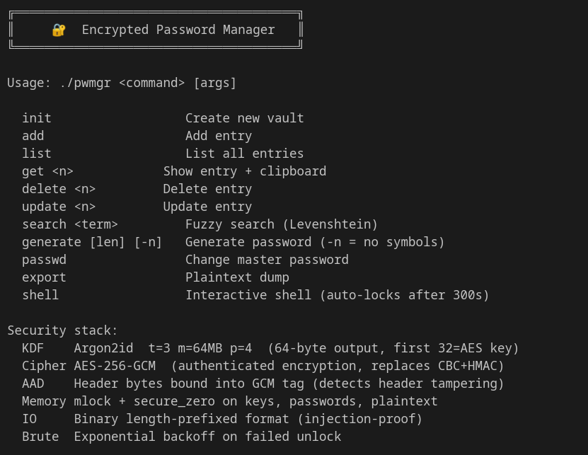

# 🔐 PWMGR

### Hardened CLI Password Manager (AES-256-GCM + Argon2id)

[](https://github.com/Xyt564/cli-password-manager-encrypted/blob/main/LICENSE)
[](https://github.com/Xyt564/cli-password-manager-encrypted/blob/main/SECURITY.md)

A security-focused, fully offline **command-line password manager** written in modern C++.

---

PWMGR uses:

* **Argon2id** (memory-hard KDF)
* **AES-256-GCM** (authenticated encryption)
* Secure memory locking & zeroization
* Brute-force resistance with exponential backoff

No cloud.
No telemetry.
No background services.

---

## ✨ Features

* 🔒 AES-256-GCM authenticated encryption
* 🧠 Argon2id (64MB memory cost)
* 🛡 Header tamper detection via AAD binding
* 🧼 `mlock` + secure memory zeroing
* ⏳ Exponential delay on failed unlock attempts
* 🔎 Fuzzy search (Levenshtein distance)
* 📋 Clipboard auto-clear (20 seconds)
* 🧾 Interactive shell with auto-lock
* 🔑 High-entropy password generator
* 📦 Binary injection-safe vault format

---

## 📸 Screenshot

Interactive shell mode:



---

## 🛠 Installation

### Requirements

* Linux
* `libssl-dev`
* `libargon2-dev`
* C++17 compatible compiler

Install dependencies (Debian/Ubuntu):

```bash
sudo apt install libssl-dev libargon2-dev
```

---

## 🔨 Build

This project includes a `Makefile`.

Simply run:

```bash
make
```

That’s it.

The binary will be created as:
---

If you want, I can now:

* Make this look even more “elite crypto project” style
* Add a SECURITY.md template
* Add a professional CONTRIBUTING.md
* Add more advanced GitHub shields
* Add CI badge setup
* Add ASCII banner branding

Just tell me the vibe you want (minimal / enterprise / hardcore security project / hacker aesthetic).


```bash
./pwmgr
```

Optional install:

```bash
sudo make install
```

---

## 🚀 Usage

```bash
pwmgr <command>
```

### Commands

```
init                  Create new vault
add                   Add entry
list                  List entries
get <name>            Show entry + clipboard
delete <name>         Delete entry
update <name>         Update entry
search <term>         Fuzzy search
generate [len] [-n]   Generate password (-n = no symbols)
passwd                Change master password
export                Plaintext export
shell                 Interactive shell (auto-locks)
```

---

## 🔐 Security Architecture

| Layer                   | Implementation                |
| ----------------------- | ----------------------------- |
| **KDF**                 | Argon2id (t=3, m=64MB, p=4)   |
| **Cipher**              | AES-256-GCM                   |
| **Authentication**      | 16-byte GCM tag               |
| **AAD Binding**         | Header authenticated          |
| **Memory Protection**   | `mlock`, explicit zeroization |
| **Vault Format**        | Binary, length-prefixed       |
| **Brute-force Defense** | Exponential backoff (max 30s) |

---

## 📂 Vault Location

```
~/.pwmgr_vault
```

Failed attempt counter:

```
~/.pwmgr_attempts
```

---

## ⚠️ Threat Model

PWMGR protects against:

* Offline brute-force attacks
* GPU/ASIC cracking (Argon2id)
* Vault tampering
* Memory scraping of plaintext after use

PWMGR does **NOT** protect against:

* Malware on the host system
* Keyloggers
* Root/system compromise
* Clipboard interception during exposure window

---

## 🔐 Security Policy

See **SECURITY.md** for vulnerability disclosure guidelines.

Please report security issues responsibly.

---

## 📜 License

See **LICENSE** for full license text.

---

## 🧠 Design Goals

PWMGR is built to be:

* Minimal
* Transparent
* Auditable
* Hardened
* Fully offline
