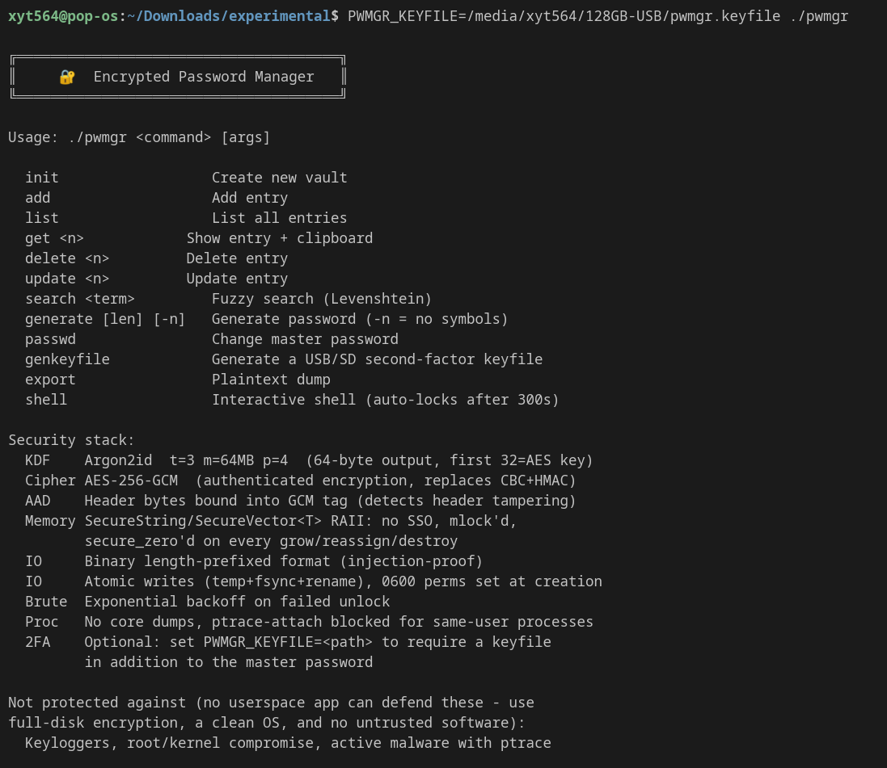

# 🔐 PWMGR

### Hardened Offline Password Manager (AES-256-GCM + Argon2id)

[](https://github.com/Xyt564/cli-password-manager-encrypted/blob/main/LICENSE)
[](https://github.com/Xyt564/cli-password-manager-encrypted/blob/main/SECURITY.md)

A security-focused, fully offline command-line password manager written in modern C++.

PWMGR is designed around one principle:

> **Keep your secrets local, encrypted, and under your control.**

No cloud services. No telemetry. No background daemons.

> Beta version now available with more security options, stable is recommended but beta is more secure (just need to test and audit it)

---

# ✨ Features

* 🔒 AES-256-GCM authenticated encryption
* 🧠 Argon2id memory-hard key derivation
* 🔑 Optional external keyfile authentication
* 💾 Unlock your vault using a USB drive, SD card or other removable media
* 🛡 Process hardening (anti-ptrace & core dump protection)
* 🧼 Secure memory locking and automatic zeroisation
* 🔍 Fuzzy search (Levenshtein distance)
* 📋 Clipboard support with automatic clearing
* 🔑 Cryptographically secure password generation
* 🖥 Interactive shell with automatic locking
* 📦 Binary encrypted vault format
* 💥 Atomic vault writes with crash recovery
* 🔄 Master password changing
* 📤 Plaintext export

---

# 📸 Screenshot

Interactive shell mode:



---

# 🛠 Installation

## Requirements

* Linux
* C++17 compatible compiler
* OpenSSL
* Argon2

Debian / Ubuntu:

```bash
sudo apt install libssl-dev libargon2-dev
```

---

# 🔨 Build

Compile:

```bash
make
```

Install system-wide:

```bash
sudo make install
```

Run locally:

```bash
./pwmgr
```

or

```bash
pwmgr
```

---

# 📖 Usage

```bash
pwmgr <command>
```

## Commands

```text
init                     Create a new encrypted vault
add                      Add a password entry
list                     List stored entries
get <name>               Retrieve an entry
delete <name>            Delete an entry
update <name>            Update an existing entry
search <term>            Fuzzy search entries
generate [len] [-n]      Generate a secure password
genkeyfile               Generate an external authentication keyfile
passwd                   Change the master password
export                   Export the vault as plaintext
shell                    Launch the interactive shell
```

---

# 🔑 Optional Keyfile Authentication

PWMGR supports an optional second authentication factor using an external keyfile.

Generate a keyfile:

```bash
pwmgr genkeyfile
```

Store the generated keyfile somewhere **off the computer**, for example:

* USB Flash Drive
* SD Card
* External SSD

When unlocking the vault, provide the keyfile using the `PWMGR_KEYFILE` environment variable:

```bash
PWMGR_KEYFILE=/path/to/pwmgr.keyfile ./pwmgr shell
```

Example:

```bash
PWMGR_KEYFILE=/media/xyt564/128GB-USB/pwmgr.keyfile ./pwmgr shell
```

The contents of the keyfile are mixed directly into the Argon2id key derivation process.

This means an attacker must possess **both** your master password **and** your keyfile in order to decrypt the vault.

The keyfile is **never stored inside the vault** and should remain on removable media except when required for unlocking.

---

# 🔐 Security Architecture

| Layer                      | Implementation                        |
| -------------------------- | ------------------------------------- |
| **Encryption**             | AES-256-GCM                           |
| **Key Derivation**         | Argon2id                              |
| **Authentication**         | 16-byte GCM Tag                       |
| **Header Protection**      | Authenticated Additional Data (AAD)   |
| **Optional Second Factor** | External Keyfile                      |
| **Memory Protection**      | SecureString / SecureVector + `mlock` |
| **Process Hardening**      | Anti-ptrace & Core Dump Protection    |
| **Vault Storage**          | Binary encrypted format               |
| **Write Strategy**         | Atomic writes + `fsync()`             |
| **Brute-force Protection** | Exponential retry delay               |

---

# 🚀 What's New

This release focuses on significantly improving PWMGR's security, reliability and maintainability.

## 🔑 New Features

* Added the **`genkeyfile`** command.
* Added optional external keyfile authentication.
* Keyfile data is mixed directly into the Argon2id key derivation process.
* Added automated smoke testing for the core vault workflow.

## 🔒 Security Improvements

* Hardened the running process to prevent debugger attachment and disable core dumps.
* Replaced the old locked buffer with dedicated **SecureString** and **SecureVector** containers.
* Removed the remaining use of `std::string` for passwords and cryptographic secrets.
* Fixed a password input issue that could leave plaintext copies in heap memory.
* Clipboard operations no longer create unnecessary plaintext password copies.
* Improved secure cleanup throughout the application so secrets are reliably erased during shutdown and error handling.
* Fixed password cleanup during regenerated password updates.
* Added a controlled `reveal()` interface to minimise accidental exposure of protected secrets.

## 💾 Reliability Improvements

* Vault files are now written atomically using temporary files, `fsync()` and `rename()`, preventing corruption after crashes or power failures.
* Secure `0600` permissions are applied immediately when vault files are created.
* Improved filesystem durability by synchronising updates before replacing vault data.
* Added validation of vault ownership and protection against symlink-based attacks.

## ⚙ General Improvements

* Improved command-line input validation.
* Improved case-insensitive string handling.
* Reduced unnecessary cryptographic key material generation.
* Refactored secure memory handling to simplify maintenance.
* Cleaned up compiler warnings.
* Improved overall code quality and maintainability.

---

# 📂 Vault Files

Vault:

```text
~/.pwmgr_vault
```

Failed attempt counter:

```text
~/.pwmgr_attempts
```

---

# ⚠️ Threat Model

PWMGR helps protect against:

* Offline brute-force attacks
* GPU/ASIC password cracking
* Vault tampering
* Password remnants remaining in memory
* Process inspection through ptrace
* Core dump leakage
* Accidental corruption caused by crashes or power failures

PWMGR does **not** protect against:

* Malware running on the host system
* Keyloggers
* Root/system compromise
* Clipboard interception during the exposure window
* Physical theft of both the computer and optional keyfile

---

# 🔮 Roadmap

Planned features include:

* 🔐 FIDO2 / Security Key support
* 🔐 TPM 2.0 integration
* 🔑 Hardware-backed second-factor providers
* 🧪 Expanded automated testing

---

# 🧠 Design Goals

PWMGR is built to be:

* Secure
* Minimal
* Fully Offline
* Transparent
* Auditable
* Hardened
* Lightweight
* Easy to Build

---

# 🔐 Security Policy

Please see **SECURITY.md** for responsible vulnerability disclosure guidelines.

---

# 📜 License

See **LICENSE** for the full license text.

---

# 🤖 Note

> The ASCII banners displayed by PWMGR were generated using AI. All application logic, cryptography, security features and implementation were written manually. AI was only used to generate the decorative terminal banners.
