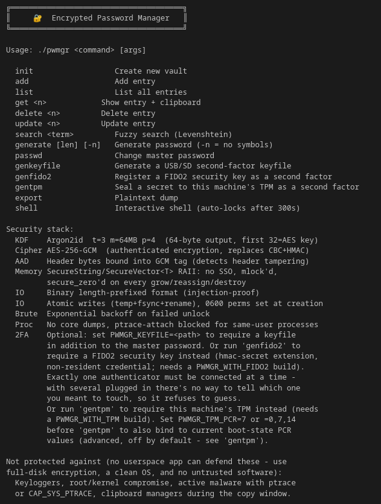

# 🔐 PWMGR

### Hardened Offline Password Manager (AES-256-GCM + Argon2id)

[](https://github.com/Xyt564/cli-password-manager-encrypted/blob/main/LICENSE)
[](https://github.com/Xyt564/cli-password-manager-encrypted/blob/main/SECURITY.md)

A security-focused, fully offline command-line password manager written in modern C++.

PWMGR is designed around one principle:

> **Keep your secrets local, encrypted, and under your control.**

No cloud services.  
No telemetry.  
No background daemons.

---

# 🚧 Beta Version

This directory contains the beta version of PWMGR.

The purpose of this release is to improve the security architecture, reliability, and maintainability of PWMGR while introducing additional authentication options.

This version includes:

* 🔐 Experimental FIDO2 / Security Key support
* 🔐 Experimental TPM 2.0 integration
* 🔑 Hardware-backed authentication support
* 🛡 Security hardening improvements
* 🩹 Vulnerability and bug fixes
* 🔍 Code auditing and internal cleanup
* 🧪 Expanded automated testing

Although these features are functional, this release is still considered beta software. Features, formats, and behaviour may change before the stable release.

---

# ✨ Features

## 🔐 Cryptography

* 🔒 AES-256-GCM authenticated encryption
* 🧠 Argon2id memory-hard key derivation
* 🔑 Optional external keyfile authentication
* 🔐 Experimental FIDO2 security key authentication
* 🔐 Experimental TPM 2.0 authentication
* 🛡 Authenticated vault metadata using AAD
* 📦 Binary encrypted vault format

---

## 🛡 Security Hardening

* 🔒 Secure memory handling
* 🧼 Automatic secret zeroisation
* 🔐 Memory locking using `mlock`
* 🛡 Anti-ptrace protection
* 💥 Core dump protection
* 🔒 Secure file permissions
* 🛡 Vault ownership validation
* 🔄 Atomic vault writes with crash recovery
* ⏳ Exponential brute-force retry delays

---

## 🖥 User Features

* 🔍 Fuzzy search using Levenshtein distance
* 📋 Clipboard support with automatic clearing
* 🔑 Cryptographically secure password generation
* 🖥 Interactive shell mode
* 🔒 Automatic session locking
* 🔄 Master password changing
* 📤 User-controlled plaintext export

---

## 💾 Authentication Options

PWMGR supports multiple authentication methods:

### Master Password

The primary authentication method.

### External Keyfile

An optional second authentication factor stored separately from the vault.

Supported storage:

* USB drives
* SD cards
* External SSDs
* Other removable media

### FIDO2 Security Keys *(Experimental)*

Support for hardware security keys such as FIDO2-compatible devices.

### TPM 2.0 *(Experimental)*

Support for binding authentication to the local machine's TPM hardware.

---

# 📸 Screenshot

Interactive shell mode:



---

# 🛠 Installation

## Requirements

* Linux
* C++17 compatible compiler
* OpenSSL
* Argon2
* *(Optional)* libfido2
* *(Optional)* TPM2-TSS

Debian / Ubuntu:

```bash
sudo apt install libssl-dev libargon2-dev libfido2-dev libtss2-dev
```

Optional dependency checks:

```bash
pkg-config --exists libfido2 && echo "fido2 OK"
```

```bash
pkg-config --exists tss2-esys && echo "tpm2-tss OK"
```

---

# 🔨 Build

Compile with experimental hardware authentication support:

```bash
make WITH_FIDO2=1 WITH_TPM=1
```

Run locally:

```bash
./pwmgr
```

# 📖 Usage

```bash
pwmgr <command>
```

## Commands

```text
init                     Create a new encrypted vault
add                      Add a password entry
list                     List stored entries
get <name>               Retrieve an entry
delete <name>            Delete an entry
update <name>            Update an existing entry
search <term>            Fuzzy search entries
generate [len] [-n]      Generate a secure password
genkeyfile               Generate an external authentication keyfile
passwd                   Change the master password
export                   Export the vault as plaintext
shell                    Launch the interactive shell
```

---

# 🔐 Hardware Authentication

PWMGR includes experimental support for hardware-backed authentication.

These features are enabled during compilation:

```bash
make WITH_FIDO2=1 WITH_TPM=1
```

---

## 🔑 FIDO2 Security Key Support

PWMGR can use a FIDO2-compatible security key as an additional authentication method.

Examples:

* YubiKey
* Nitrokey
* Other FIDO2-compatible devices

Generate FIDO2 authentication:

```bash
pwmgr genfido2
```

The security key must then be present when unlocking the vault.

---

## 🔐 TPM 2.0 Support

PWMGR can optionally bind authentication to the machine's TPM 2.0 hardware.

Generate TPM authentication:

```bash
pwmgr gentpm
```

The vault can then require the TPM-backed authentication provider on that machine.

---

# 🔑 Optional Keyfile Authentication

PWMGR supports an optional external keyfile as a second authentication factor.

Generate a keyfile:

```bash
pwmgr genkeyfile
```

Store the generated keyfile somewhere **separate from the computer**, such as:

* USB flash drive
* SD card
* External SSD

A helper script is included to automatically detect removable storage devices.

---

## Unlocking With a Keyfile

Provide the keyfile path using the `PWMGR_KEYFILE` environment variable:

```bash
PWMGR_KEYFILE=/path/to/pwmgr.keyfile ./pwmgr shell
```

Example:

```bash
PWMGR_KEYFILE=/media/user/USB/pwmgr.keyfile ./pwmgr shell
```

The keyfile contents are mixed directly into the Argon2id key derivation process.

This means an attacker requires:

1. The master password
2. The external keyfile

in order to derive the encryption key.

The keyfile is:

* Never stored inside the vault
* Not recoverable from the vault
* Intended to remain offline when not in use

---

# 🏗 Security Architecture

| Layer | Implementation |
| --- | --- |
| Encryption | AES-256-GCM |
| Key Derivation | Argon2id |
| Authentication | 16-byte GCM authentication tag |
| Header Protection | Authenticated Additional Data (AAD) |
| Optional Second Factor | External Keyfile |
| Hardware Authentication | FIDO2 / TPM 2.0 |
| Memory Protection | SecureString / SecureVector + `mlock` |
| Process Hardening | Anti-ptrace + Core Dump Protection |
| Vault Storage | Binary encrypted format |
| Write Strategy | Atomic writes + `fsync()` |
| Brute-force Protection | Exponential retry delay |

---

# 🚀 What's New

This beta release focuses on improving PWMGR's security architecture, reliability, and authentication capabilities.

Major improvements include:

* Experimental FIDO2 security key support
* Experimental TPM 2.0 integration
* Security vulnerability fixes
* Internal security review
* Improved secure memory handling
* Reliability improvements
* Expanded testing coverage

---

# 🔑 New Features

## Hardware Authentication

* Added experimental FIDO2 security key authentication.
* Added experimental TPM 2.0 authentication.
* Added hardware-backed authentication providers.

## External Authentication

* Added the `genkeyfile` command.
* Added optional external keyfile authentication.
* Keyfile material is mixed directly into Argon2id key derivation.

## Testing

* Added automated smoke testing for the core vault workflow.

---

# 🔒 Security Improvements

* Hardened the running process to prevent debugger attachment.
* Disabled core dump generation to prevent memory leakage.
* Replaced unsafe secret handling with dedicated secure containers.
* Removed remaining uses of standard strings for cryptographic secrets.
* Fixed password input handling issues that could leave plaintext remnants.
* Improved clipboard handling to reduce unnecessary password copies.
* Improved secure cleanup during shutdown and error handling.
* Added controlled secret reveal interfaces to reduce accidental exposure.
* Fixed cleanup issues during password regeneration.

---

# 💾 Reliability Improvements

* Vault writes are now performed atomically using:
  * Temporary files
  * `fsync()`
  * Atomic rename operations

This prevents vault corruption caused by:

* Power failures
* Crashes
* Interrupted writes

Additional improvements:

* Secure `0600` permissions applied immediately.
* Improved vault ownership validation.
* Protection against symlink-based filesystem attacks.
* Reduced unnecessary cryptographic key generation.
* Improved filesystem durability.

# ⚙ General Improvements

This beta release also includes improvements to maintainability and overall code quality.

Changes include:

* Improved command-line input validation.
* Improved case-insensitive string handling.
* Refactored secure memory management.
* Reduced unnecessary cryptographic operations.
* Cleaned compiler warnings.
* Improved code organisation and maintainability.
* Improved error handling throughout the application.

---

# 📂 Vault Files

Default vault location:

```text
~/.pwmgr_vault
```

Failed authentication attempt counter:

```text
~/.pwmgr_attempts
```

Vault files are protected using restrictive filesystem permissions.

---

# ⚠️ Threat Model

PWMGR is designed to protect against:

## ✅ Protected Against

### Offline attacks

* Brute-force attacks against stolen vault files.
* GPU/ASIC password cracking attempts.
* Weak password exposure through memory-hard key derivation.

### Vault tampering

* Unauthorized modification of encrypted vault data.
* Corrupted writes caused by crashes or power loss.

### Memory exposure

* Password remnants remaining in memory.
* Unnecessary secret copies.
* Core dump leakage.

### Process inspection

* Debugger attachment attempts through ptrace.
* Accidental memory exposure through system diagnostics.

---

## ❌ Not Protected Against

PWMGR cannot protect against a fully compromised system.

This includes:

* Malware running on the host system.
* Keyloggers.
* Root/system-level compromise.
* A malicious operating system.
* Clipboard interception while passwords are exposed.
* Physical theft of both the computer and external authentication factors.

Security depends on the security of the machine running PWMGR.

---

# 🧠 Design Goals

PWMGR is built around the following principles:

* 🔒 Secure
* 🪶 Minimal
* 🌐 Fully Offline
* 🔍 Transparent
* 🧪 Auditable
* 🛡 Hardened
* ⚡ Lightweight
* 🔨 Easy to Build

The goal is to provide a password manager that keeps encrypted secrets local while avoiding unnecessary complexity and external dependencies.

---

# 🔐 Security Policy

Security issues should be reported responsibly.

Please see:

`SECURITY.md`

for vulnerability disclosure guidelines.

---

# 📜 License

See:

`LICENSE`

for the complete license text.

---

# 🤖 Note

The ASCII banners displayed by PWMGR were generated using AI.

All application logic, cryptographic implementation, security features, and hardening work were written manually.

AI assistance was only used for decorative terminal banners.
